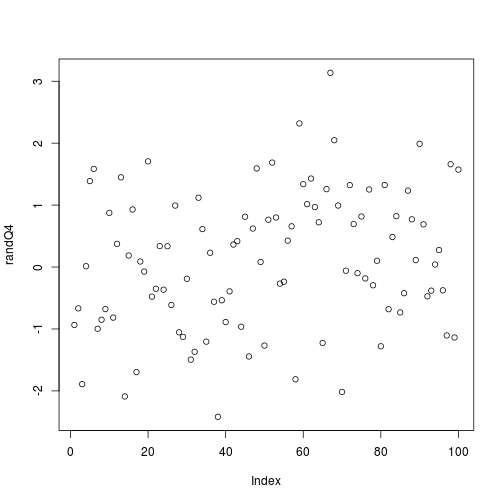
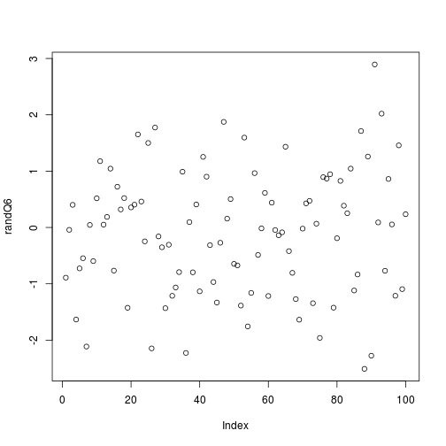
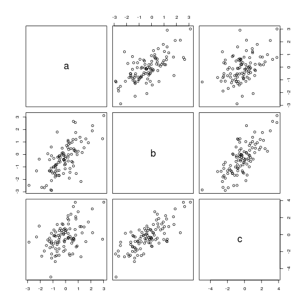
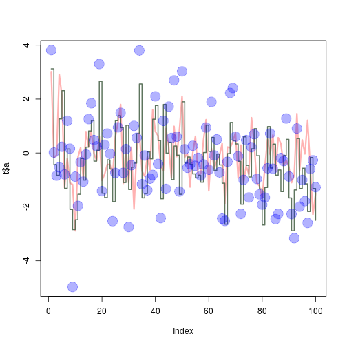
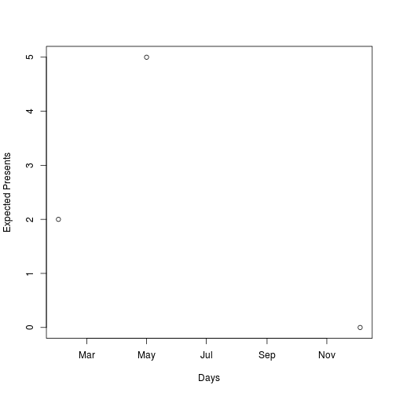

# **Assignment 0**
Michael Zuccaro

Due: February 1, 2016

## **Introduction**

**Github Username:** michaelzuccaro

The objective of this assignment is to complete each of the 'ToDo' exercises that exist with the document of ["A Very Short Introduction to R"](https://cran.r-project.org/doc/contrib/Torfs+Brauer-Short-R-Intro.pdf). There were a total of 14 exercises all together along with an extra, making a total of 15. We must then publish the report and code onto our github accounts.

## **ToDo Exercises**

**1.)**
Compute the difference between 2016 and the year started at Seneca. Then divide this by the difference between 2016 and the year I was born. Then I must multiply this by 100 to get the percentage of my life spent at Seneca.

```r
((2016-2014)/(2016-1995))*100
```

```
## [1] 9.52381
```

**2.)**
For this question it is a repeat of the previous ToDo but with several steps in between. This is done by using variables.

```r
schoolYear <- (2016-2014)
lifeYear <- (2016-1995)
lifeSpent <- (schoolYear/lifeYear) * 100
lifeSpent
```

```
## [1] 9.52381
```

**3.)**
For this ToDo we must compute the sum of 4, 5, 8 and 11 by combining them into a vector and then using the function 'sum' to do so.

```r
vectorQ3 <- c(4, 5, 8, 11)
sum(vectorQ3)
```

```
## [1] 28
```

**4.)**
Plot 100 normal random numbers into a graph.

```r
randQ4 = rnorm(100)
plot(randQ4)
```



**5.)**
Find help for the sqrt function, do so by searching 'sqrt' in the search bar under the 'Help' tab. This displayed the following: "abs(x) computes the absolute value of x, while sqrt(x) computes the (principal) square root of x, √{x}."

```r
help(sqrt)
```

**6.)**
Make a file called firstscript.R that contains R-code that
generates 100 random numbers and plots them.

```r
source("/home/mzuccaro1/Desktop/Assignment 0/firstscript.R")
```



**7.)**
Put the numbers 31 to 60 in a vector named 'P' and then in a matrix with 6 rows and 5 columns named 'Q'.

```r
Q <- matrix(P <- c(31:60), nrow=6, ncol=5)
Q
```

```
##      [,1] [,2] [,3] [,4] [,5]
## [1,]   31   37   43   49   55
## [2,]   32   38   44   50   56
## [3,]   33   39   45   51   57
## [4,]   34   40   46   52   58
## [5,]   35   41   47   53   59
## [6,]   36   42   48   54   60
```

**8.)**
Constructs three random normal vectors of length 100 called x1, x2 and x3. Then make a data frame named 't' with three columns 'a', 'b', 'c'. Containing respectively 'x1', 'x1+x2', 'x1+x2+x3'. Then call the data frame with plot(t) and sd(t).

```r
x1 <- c(rnorm(100))
x2 <- c(rnorm(100))
x3 <- c(rnorm(100))

t <- data.frame(a = x1, b = (x1+x2), c = (x1+x2+x3))

plot(t)
```



```r
sd(x1)
```

```
## [1] 1.026737
```

```r
sd(x2)
```

```
## [1] 0.9471027
```

```r
sd(x3)
```

```
## [1] 1.018771
```

**9.)**
Add the lines to the script file of the previous ToDo then try to find out what the meaning of 'rgb'and the last arguments of 'rgb', 'lwd', 'pch' and 'cex'.

```r
help(rgb)
plot(t$a, type="l", ylim=range(t),lwd=3, col=rgb(1,0,0,0.3))
lines(t$b, type="s", lwd=2, col=rgb(0.3,0.4,0.3,0.9))
points(t$c, pch=20, cex=4, col=rgb(0,0,1,0.3))
```



*rgb:* Creates colors corresponding to given values from a range of '0 and max'. The rgb values represent red, green and blue.

*pch:* Plotting 'character', either single character or an integer code for a set of graphics symbols.

*lwd:* The line width when drawing symbols.

*cex:* This is for character or symbol expansion on a numerical vector.

**10.)**
Make a file called tst1.txt in Notepad from the example in the Figure 4 and then store it in your working directory. Then write a script to read it and multiply the column called 'g' by '5'. Store this as result as tst2.txt.


```r
varQ10a <- data.frame(read.table(file="/home/mzuccaro1/Desktop/Assignment 0/tst1.txt", header=TRUE))
varQ10b <- data.frame(a = varQ10a$a, g = varQ10a$g * 5, x = varQ10a$x)
write.table(varQ10b, file="/home/mzuccaro1/Desktop/Assignment 0/tst2.txt", row.names=FALSE)
```

**11.)**
Compute the mean of the square root of a vector of 100 random numbers? Whats the result?

```r
vectorQ11 <- c(rnorm(100))
sqrtQ11 <- sqrt(vectorQ11)
```

```
## Warning in sqrt(vectorQ11): NaNs produced
```

```r
sqrtQ11[is.na(sqrtQ11)] <- 0
mean(sqrtQ11)
```

```
## [1] 0.3774954
```

The result is not available to be computed. This is due to the NaN's being produced by the sqrt() function. In order to prevent this I had added the third line in my code to elimate all occurences of NaN's.

**12.)**
Make a graph with on the X-axis: Today, Sinterklass 2016, next birthday. On the Y-axis: Number of presents you expect on these days.

```r
xAxeQ12 <- strptime(c("20160201", "20161205", "20160501"), format="%Y%m%d")
yAxeQ12 <- c(2, 0, 5)
plot(xAxeQ12, yAxeQ12, xlab='Days', ylab='Expected Presents')
```



**13.)**
Make a vector from 1 to 100. Make a for-loop which runs through the whole vector. Then multiply the elements which are smaller than 5 or larger than 90 with 10 and the other elements with 0.1.

```r
vectorQ13a <- c(1:100)
vectorQ13b <- c()

for(i in 1:length(vectorQ13a))
{
  if (vectorQ13a[i] < 5)
  {
    vectorQ13b[i] <- (vectorQ13a[i] * 10)
  }else if (vectorQ13a[i] > 90) {
    vectorQ13b[i] <- (vectorQ13a[i] * 10)
  }else {
    vectorQ13b[i] <- (vectorQ13a[i] * 0.1)
  }
}

vectorQ13b
```

```
##   [1]   10.0   20.0   30.0   40.0    0.5    0.6    0.7    0.8    0.9    1.0
##  [11]    1.1    1.2    1.3    1.4    1.5    1.6    1.7    1.8    1.9    2.0
##  [21]    2.1    2.2    2.3    2.4    2.5    2.6    2.7    2.8    2.9    3.0
##  [31]    3.1    3.2    3.3    3.4    3.5    3.6    3.7    3.8    3.9    4.0
##  [41]    4.1    4.2    4.3    4.4    4.5    4.6    4.7    4.8    4.9    5.0
##  [51]    5.1    5.2    5.3    5.4    5.5    5.6    5.7    5.8    5.9    6.0
##  [61]    6.1    6.2    6.3    6.4    6.5    6.6    6.7    6.8    6.9    7.0
##  [71]    7.1    7.2    7.3    7.4    7.5    7.6    7.7    7.8    7.9    8.0
##  [81]    8.1    8.2    8.3    8.4    8.5    8.6    8.7    8.8    8.9    9.0
##  [91]  910.0  920.0  930.0  940.0  950.0  960.0  970.0  980.0  990.0 1000.0
```

**14.)**
Write a function for the previous ToDo so that you can feed
it any vector you like (as argument). Use a for-loop in the function to do the computation with each element. Use the standard R function 'length' in the specification of the counter.

```r
funQ14 <- function(arg1)
{
  vFunQ14 <- c()
  for(i in 1:length(arg1))
  {
    if (arg1[i] < 5)
    {
      vFunQ14[i] <- (arg1[i] * 10)
    }else if (arg1[i] > 90) {
      vFunQ14[i] <- (arg1[i] * 10)
    }else {
      vFunQ14[i] <- (arg1[i] * 0.1)
    }
  }
  return(vFunQ14)
}

funQ14(arg1 <- vectorQ13a)
```

```
##   [1]   10.0   20.0   30.0   40.0    0.5    0.6    0.7    0.8    0.9    1.0
##  [11]    1.1    1.2    1.3    1.4    1.5    1.6    1.7    1.8    1.9    2.0
##  [21]    2.1    2.2    2.3    2.4    2.5    2.6    2.7    2.8    2.9    3.0
##  [31]    3.1    3.2    3.3    3.4    3.5    3.6    3.7    3.8    3.9    4.0
##  [41]    4.1    4.2    4.3    4.4    4.5    4.6    4.7    4.8    4.9    5.0
##  [51]    5.1    5.2    5.3    5.4    5.5    5.6    5.7    5.8    5.9    6.0
##  [61]    6.1    6.2    6.3    6.4    6.5    6.6    6.7    6.8    6.9    7.0
##  [71]    7.1    7.2    7.3    7.4    7.5    7.6    7.7    7.8    7.9    8.0
##  [81]    8.1    8.2    8.3    8.4    8.5    8.6    8.7    8.8    8.9    9.0
##  [91]  910.0  920.0  930.0  940.0  950.0  960.0  970.0  980.0  990.0 1000.0
```

**15.)**
Perform the ToDo above and do it without using a for-loop but with regular vector computations instead.

```r
vectorQ15 <- c(1:100)
ifelse(vectorQ15 < 5 | vectorQ15 > 90, vectorQ15 * 10, vectorQ15 * 0.1)
```

```
##   [1]   10.0   20.0   30.0   40.0    0.5    0.6    0.7    0.8    0.9    1.0
##  [11]    1.1    1.2    1.3    1.4    1.5    1.6    1.7    1.8    1.9    2.0
##  [21]    2.1    2.2    2.3    2.4    2.5    2.6    2.7    2.8    2.9    3.0
##  [31]    3.1    3.2    3.3    3.4    3.5    3.6    3.7    3.8    3.9    4.0
##  [41]    4.1    4.2    4.3    4.4    4.5    4.6    4.7    4.8    4.9    5.0
##  [51]    5.1    5.2    5.3    5.4    5.5    5.6    5.7    5.8    5.9    6.0
##  [61]    6.1    6.2    6.3    6.4    6.5    6.6    6.7    6.8    6.9    7.0
##  [71]    7.1    7.2    7.3    7.4    7.5    7.6    7.7    7.8    7.9    8.0
##  [81]    8.1    8.2    8.3    8.4    8.5    8.6    8.7    8.8    8.9    9.0
##  [91]  910.0  920.0  930.0  940.0  950.0  960.0  970.0  980.0  990.0 1000.0
```


## **Sources**

["R Markdown - Dynamic Documents for R"](http://rmarkdown.rstudio.com/)

["Writing reproducible reports in R with markdown, knitr and pandoc"](http://nicercode.github.io/guides/reports/)

["Markdown"](http://kbroman.org/knitr_knutshell/pages/markdown.html)

["Knitr with R Markdown"](http://kbroman.org/knitr_knutshell/pages/Rmarkdown.html)

["R Markdown Cheatsheet"](https://www.rstudio.com/wp-content/uploads/2015/02/rmarkdown-cheatsheet.pdf)
